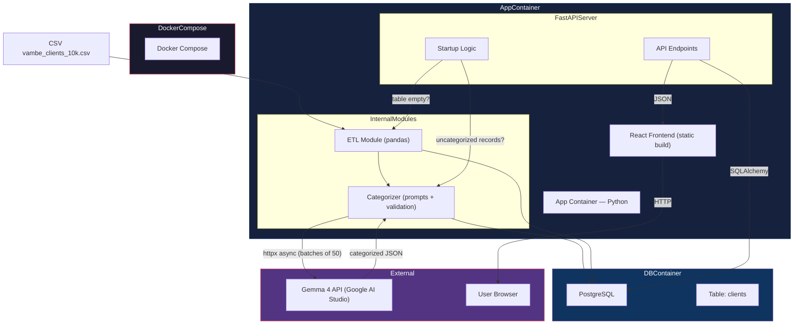
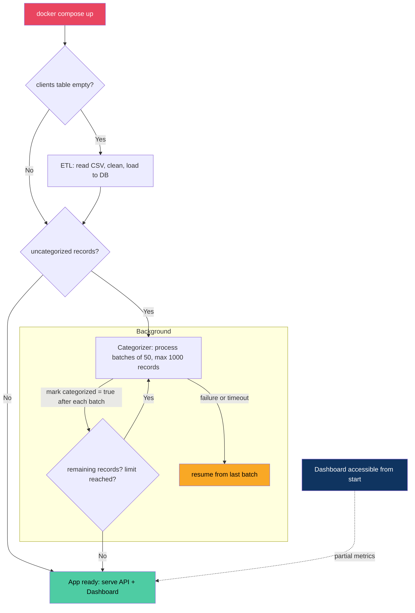

# Architecture

## What "Doing a Good Job" Means

This project processes sales meeting transcripts, categorizes them with an LLM, and presents metrics in an interactive dashboard. A successful implementation:

1. **Works end-to-end**: CSV → DB → Categorization → API → Dashboard
2. **Is deterministic**: Same input produces same output (temperature 0, closed enums)
3. **Handles failures gracefully**: LLM errors, malformed JSON, partial data
4. **Is verifiable**: Tests cover critical logic, not just happy paths
5. **Is deployable**: Single `docker compose up` starts everything

## Key Decisions

- **Monorepo**: Frontend and backend share one repo. Frontend builds to static files served by FastAPI.
- **1,000 records**: The categorizer processes 1,000 records (10% of dataset) due to API rate limits. Architecture supports full dataset by changing one config value.
- **PostgreSQL**: Required for complex queries (filters, aggregations). SQLite would not support production-like patterns.
- **Gemma 4 via httpx**: Direct HTTP calls, no SDK dependency. Async for concurrency.

---

## Architecture Overview

### Component Diagram

How the pieces fit together at a high level. Two containers orchestrated by Docker Compose: the app (FastAPI + React build) and PostgreSQL. External dependencies: Gemma 4 API for categorization and the user's browser.

### Startup Flow

What happens when you run `docker compose up`. The ETL and categorizer run automatically on first start. On subsequent starts, they are skipped (idempotent).

### Data Flow (ETL → Categorization → Dashboard)

How data moves through the system in three stages:

```mermaid
flowchart LR
    subgraph S1[ETL]
        CSV["CSV"] --> Clean["Clean (pandas)"]
        Clean --> Load["Load to PostgreSQL"]
    end

    subgraph S2[Categorization]
        DB1["DB — uncategorized"] --> Prompt["Structured prompt"]
        Prompt --> LLM["Gemma 4 API"]
        LLM --> Validate["Validate categories"]
        Validate --> DB2["DB — categorized"]
    end

    subgraph S3[Dashboard]
        DB3["DB — enriched"] --> API["FastAPI endpoints"]
        API --> FE["React + Chart.js"]
        FE --> User["User filters and explores"]
    end

    Load --> DB1
    DB2 --> DB3

    style S1 fill:#0f3460,color:#fff
    style S2 fill:#533483,color:#fff
    style S3 fill:#4ecca3,color:#000
```

> **Partial metrics**: While categorization runs in background, the dashboard shows metrics on already-categorized data. A "Refresh metrics" button lets the user update without restarting the process.

---

## Anti-patterns to Avoid

- Over-abstracting (no need for service layers, repositories, or factories in a project this size)
- Testing the LLM directly (mock it — LLM behavior is non-deterministic)
- Frontend state management libraries (React useState/useReducer is enough)
